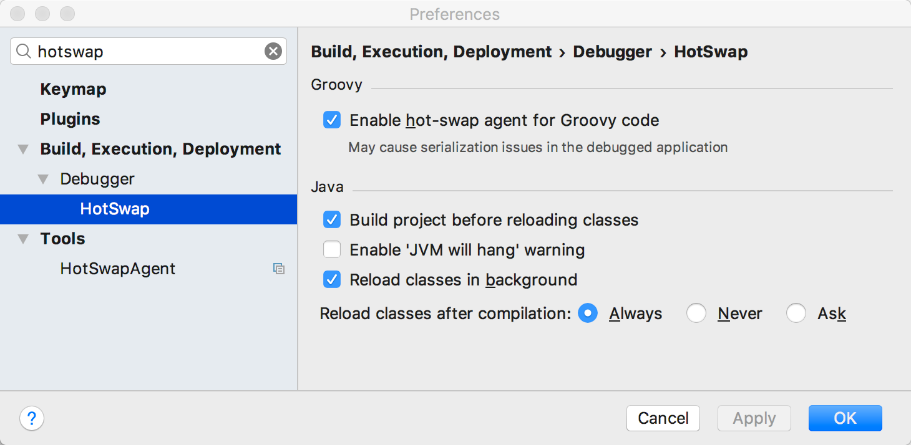
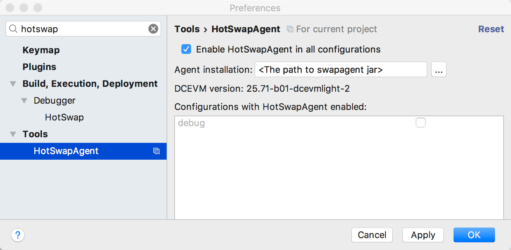

# Hybris Hot Swapping

In this tutorial we will use Intellij as IDE, other IDEs have similare configuration

## DCEVM 

[DVEVM](https://dcevm.github.io/) is the opensource alternative to JRebel.

Download DCEVM jar from :
```
https://dcevm.github.io/ and follow the 
```
Run it with 
```
sudo java -jar name-of-jar.jar
```
Choose the your java path and patch it.

## Hot Swap agent

Download the 1.1.0-SNAPSHOT release from 
```
https://github.com/HotswapProjects/HotswapAgent/releases
```

## Hybris Configuration

In order to start hybris with the the Hot Swap agent, we need to add arguments to JVM  

#### Edit local.properties

Add the following entry to local.properties

```
tomcat.debugjavaoptions=XXaltjvm=dcevm -javaagent:<replace this with the path to swapagent jar>=autoHotswap=true -Xdebug -Xnoagent -Xrunjdwp:transport=dt_socket,server=y,address=8000,suspend=n
```

#### Run ant in `hybris/bin/platform`


This will add the options to wrapper configuration file

### Download and install intellij plugin

1 - Search for HotSwapAgent and install it.

2 - make sure the configuration is as follows






### Run hybris

```
./hybrisstart.sh debug
```

Use port 8000 to connect intellij debugger to JVM

Change the code, press (: Command+Shift+F9/ ⊞: Ctrl+Shift+F9) and Enjoy ;)

